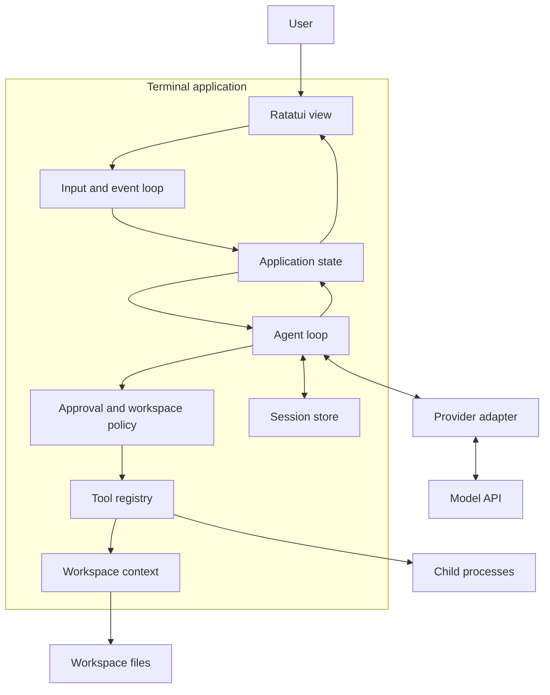
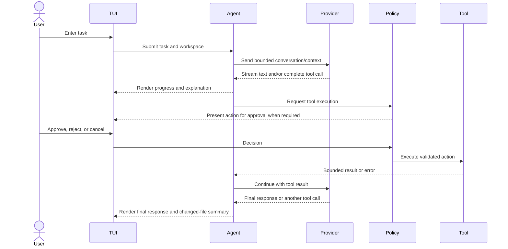

# Terminal Coding Agent Harness Design

## Purpose

Build a local-first, terminal-only coding agent as a learning project. It should teach the builder how a coding agent works by introducing one understandable subsystem at a time, with a runnable result at each milestone. The finished tool should accept a task, inspect a selected workspace, ask a model for a response or tool call, execute approved tools, and show progress and results in a TUI.

This project is a personal educational harness inspired by the interaction patterns of Codex and Claude Code. It does not aim to reproduce their proprietary internals or match their breadth at the first release.

## Product boundary

### First useful release

- Runs in a local terminal and operates only in a user-selected working directory.
- Connects to one hosted model API through a provider-neutral interface; one provider is implemented first.
- Streams assistant output, displays tool activity, and preserves a readable conversation for the current session.
- Gives the model a small, explicit set of tools: list/read files, search text, propose file edits, and run shell commands.
- Shows proposed side effects and obtains user approval before applying edits or starting commands.
- Reports tool failures and cancellation without losing the conversation or leaving the terminal in raw mode.
- Has a CLI entry point and a TUI as the primary interaction surface.

### Explicitly deferred

Multiple agents, remote/cloud execution, IDE integration, background daemon, plugin marketplace, vector database, automatic model training, broad provider parity, and unreviewed destructive command execution. These may be future independent projects after the first release works.

## Design choices

### Language and UI

Use stable Rust and Ratatui with Crossterm. Rust provides a compiled native executable, strong types across tool and model boundaries, and explicit ownership for concurrent tasks. Ratatui provides terminal widgets and a test backend, while Crossterm handles cross-platform input and terminal modes. Current Ratatui installation docs specify Rust 1.88+ and Crossterm 0.29; pin compatible versions when scaffolding. [Ratatui installation](https://ratatui.rs/installation/), [Ratatui backends](https://ratatui.rs/concepts/backends/)

Alternatives considered:

| Stack | Advantages | Trade-offs for this project | Decision |
|---|---|---|---|
| Rust + Ratatui + Tokio | Native binary; low idle overhead is achievable; explicit types and ownership make tool boundaries and cancellation instructive; purpose-built TUI library | Steeper learning curve; compile cycles; async Rust concepts add early complexity | Recommended for the performance-oriented learning goal |
| Go + Bubble Tea | Fast to learn and build; goroutines/channels make concurrent event flows approachable; native binary | Garbage collection and interface-heavy tool composition; TUI ecosystem and async stream behavior differ from Rust; likely a better first project if approachability outranks low-level learning | Strong alternative; benchmark before claiming a speed gap |
| TypeScript + Ink | Familiar web language and quick iteration; JSON and provider SDKs are convenient | Requires Node runtime; dependency footprint and distribution are less self-contained; event-loop model is adequate but less focused on native executable/runtime learning | Good for a provider-heavy prototype; not the chosen distribution/performance direction |

The language choice is not a promise that model response latency will improve. In normal network-backed use, provider latency and generated token count are expected to dominate. Measure local startup, idle memory, UI render/input latency, context assembly, tool latency, and end-to-end task duration separately.

## Performance evidence and measurement plan

There is no defensible universal throughput number for these three stacks that predicts coding-agent performance. Published language microbenchmarks use different workloads and conditions; do not copy them into marketing or use them as project results. Ratatui documents its buffer diffing behavior and describes sub-millisecond rendering, but that is library guidance rather than a benchmark of this app. [Ratatui rendering internals](https://ratatui.rs/concepts/rendering/under-the-hood/)

The roadmap must build comparable Rust, Go, and TypeScript reference implementations of the same small workloads, then report measured values and environment. Keep provider/network time out of runtime microbenchmarks and report it separately in an end-to-end scenario. Measure:

| Metric | Workload and method | Report |
|---|---|---|
| Cold start | 20 launches of a no-network `--version` and TUI-ready command after build; report median and p95 | milliseconds |
| Idle resident memory | Start at a fixed terminal size, wait 10 seconds, sample RSS for 30 seconds; report median and peak | MiB |
| Input-to-frame latency | Inject 1,000 synthetic key events at 80x24 and 160x50; timestamp event receipt to completed frame; report p50/p95/p99 | milliseconds |
| Render cost | Render a fixed 500-message transcript and 100 tool rows for 10,000 frames to a test backend; report p50/p95 | microseconds/frame |
| Context assembly | Read and assemble a fixed repository fixture (1,000 files / 100 MiB) with the same ignore rules and token budget; report wall time and peak RSS | milliseconds, MiB |
| Tool startup | Run a fixed no-op child process 100 times; report median/p95 separately from process body | milliseconds |
| End-to-end agent loop | Same provider, model, prompt, repository snapshot, and tool policy; at least 30 runs; report time-to-first-token, total time, tokens, and success rate | seconds, tokens, percent |
| Distribution size | Release artifact, stripped, same target and feature set | MiB |

Keep OS, CPU, RAM, terminal emulator, compiler/runtime versions, build flags, benchmark commit, sample count, and raw output with every result. Compare median and spread; include repeated-run variability. Do not state a result until the harness and reference implementations exist and have been run. The Go project's performance guidance likewise recommends comparisons to a baseline rather than isolated numbers. [Go performance monitoring](https://go.dev/wiki/PerformanceMonitoring)

## Architecture

Use a single process and a small workspace crate. Keep model protocol, agent orchestration, tools, policy, persistence, and terminal presentation behind narrow module interfaces. Avoid a plugin framework until a concrete second implementation needs it.

The TUI sends user intents to application state. The agent loop builds a request from conversation and bounded workspace context, asks the provider for streamed events, and turns tool calls into typed requests. Policy checks workspace boundaries and approval requirements before the registry invokes a tool. Tool results return to the agent as bounded, structured content. State changes are rendered by the UI and persisted by the session store.

### Module responsibilities

- `app`: startup, configuration, event routing, shutdown, and application state transitions.
- `ui`: Ratatui widgets and rendering only; no provider or filesystem policy logic.
- `agent`: turn state machine, message history, tool-call cycle limit, cancellation, and stop reasons.
- `providers`: provider-neutral request/event types plus one HTTP API adapter and streaming parser.
- `tools`: typed tool definitions, validation, result bounds, and execution implementations.
- `policy`: workspace-root enforcement, approval decisions, and command restrictions.
- `context`: ignore-aware file listing, search, file reading, repository instructions, and context budgeting.
- `sessions`: versioned local session records and safe save/load behavior.
- `telemetry`: structured local diagnostics and performance timestamps without logging secrets.

## Agent and tool semantics

Represent provider output as a stream of typed events: text delta, tool call start/delta/complete, usage, finish reason, and provider error. Accumulate tool arguments until complete, validate against a typed schema, and never execute partial JSON. Each agent turn has a configurable maximum tool-call count and supports cancellation. Tool output is size-bounded before it enters conversation history.

Start with read-only tools plus explicit edit and command approval. All paths must be resolved under the selected workspace root after canonicalization; reject path traversal and symlink escapes. Commands execute with an explicit working directory, captured output limits, timeout, and cancellation. Approval is bound to the displayed action and expires if the proposed action changes. Terminal restoration must run on normal exit, error, and panic paths.

## User workflow

## Reliability, privacy, and usability requirements

- The provider key comes from an environment variable or OS credential store; never write it to session files or logs.
- Session persistence is local, versioned, and recoverable after malformed or truncated data.
- Provider retries are limited to safe transient failures and must not duplicate a tool action.
- On cancellation, stop provider streaming and child processes, save a consistent session, and restore terminal settings.
- The UI remains responsive during network and tool operations; work runs outside the render/input loop.
- Errors identify whether they came from configuration, provider, policy, tool, storage, or terminal setup and give a next action.
- Narrow terminals and non-color terminals remain usable; keyboard-only operation is sufficient.

## Learning structure and project boundaries

Deliver the work as sequential milestones. Each milestone should produce a runnable increment and teach a focused concept. The implementation plan will further divide milestones into reviewable tickets, normally no larger than a few files or one interface. Ticket descriptions should include learning objective, expected behavior, concrete files/interfaces, acceptance checks, and prerequisites.

1. Rust/TUI shell and terminal lifecycle.
2. App state, input events, and conversation view.
3. Configuration, provider abstraction, and secure API setup.
4. Streaming text and cancellation.
5. Agent turn state machine and scripted fake provider.
6. Read-only workspace tools and bounded context.
7. Typed tool calls and result handling.
8. Approval UX, path confinement, and command runner.
9. File edit proposal, diff review, and apply/undo behavior.
10. Session persistence and restart recovery.
11. Robustness, accessibility, packaging, and documentation.
12. Cross-stack benchmark fixtures and measured performance report.

Milestone 12 may begin in parallel with early UI work once the workload definitions and reference interface are settled, but benchmark results must use equivalent semantics and fixtures.

## Open decisions for the implementation plan

- Select the first model provider and API protocol. Keep it isolated behind the provider interface.
- Choose the HTTP client and serialization crates based on maintained stable Rust support at implementation time.
- Choose a minimum supported OS set (recommended: Linux and macOS first; validate Windows terminal behavior before claiming support).
- Decide whether file edits use a patch format supplied by the model or an application-owned structured edit format; prefer a reviewable unified diff for the first release.
- Define initial context limits and defaults in configuration; make them visible and adjustable rather than hard-coded silently.

## Source notes

Current ecosystem facts checked 2026-10-03. Ratatui describes immediate-mode drawing into an intermediate buffer and diff-based terminal writes. Go's own performance guidance emphasizes comparisons against a baseline. Neither source supplies a fair Rust/Go/TypeScript benchmark for this workload. [Ratatui rendering internals](https://ratatui.rs/concepts/rendering/under-the-hood/), [Go performance monitoring](https://go.dev/wiki/PerformanceMonitoring)
